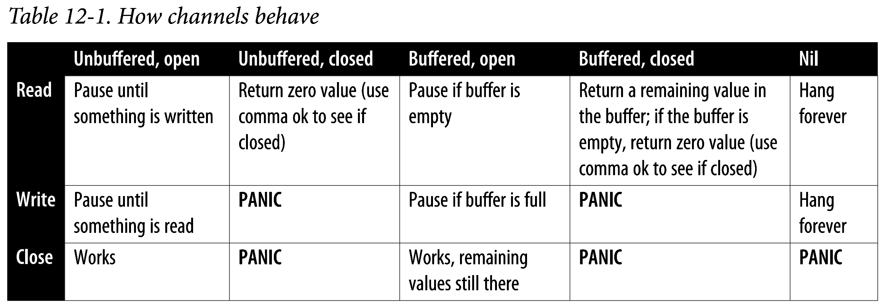

# Links

* codebase for the book: https://github.com/learning-go-book-2e
* similar to npmjs: https://pkg.go.dev/

# Commands

```
go get ./.. - scans my source code to find out which modules to download 

go get 

go get github.com/shopspring/decimal

go get github.com/learning-go-book-2e/simpletax@v1.0.0 - get a specific version 
of a module

go get -u=patch - upgrade to the bug patch release

go get -u github.com/learning-go-book-2e/simpletax - upgrade to the latest 
available version

go mod tidy - scan the source code and synchronize the go.mod and go.sum files, 
adding and removing references

go list -m -versions github.com/learning-go-book-2e/simpletax - lists available 
version for a given module

go mod vendor - creates a directory 'vendor' at the top level of the module 
that contains all your modules dependencies. Needs to be run everythime a new 
dependency is added or upgraded. This has fallen out of favour. Can speed up builds though.

go test - run tests in current directory
go test ./... - run tests in current director AND all subdirectories
```

# Book

## Chapter 6: Pointers

How to create pointers:

```go
package main

var x int32 = 10
var y bool = true

pointerX := &x
pointerY := &y

var pointerZ *string
```

> The & is the address operator. It precedes the value type and returns the address
> where the value is stored:

```go
x := "hello"
pointerToX := &x
```

> the * is the indirection operator. It precedes a variable of pointer type and
> returns the pointed-to value. This is called dereferencing.

```go
package main

x := 10
pointerToX := &x
fmt.Println(pointerToX) // prints memory address
fmt.Println(*pointerToX) // prints 10
z := 5 + *pointerToX
fmt.Println(z) // prints 15
```

> Before dereferencing a pointer, you must make sure that the pointer is non-nil. Your
> program will panic if you attempt to dereference a `nil` pointer!

```go
package main

var x *int
fmt.Println(x == nil) // prints true
fmt.Println(*x) // panics
```

> A pointer type is a type that represents a pointer. It is written with a * before
> a type name. A pointer type can be based on any type.

```go
x := 10
var pointerToX *int
pointerToX := &x
```

> To create a pointer for structs do this:

```go
type person struct {
    firstName string
    lastName  string
}

mike := &person{
    firstName: "Mi",
    lastName:  "ke",
}

fmt.Println(mike) // prints &{Mi ke}
fmt.Println(&mike) // prints something like 0x14000116018
```

> when you need a pointer to a primitive type, declare a variable
> and point to it

```go
var y string
z := &y
```

> not being able to take the address of a constant is sometimes
> inconvenient. if you have a struct with a field of a pointer
> to a primitive type, you can't assign a literal directly to
> the field

```go
type person struct {
	FirstName string
	MiddleName *string
}

p1 := person{
	FirstName: "X",
	MiddleName: "Y" // this line won't compile
}

// solution
func makePointer[T any](t T) *T {
	return &t
}

p2 := person{
    FirstName: "X",
    MiddleName: makePointer("Y") // this works, see pg123 for explanation
}
```

From pg 124:

> **The difference between Go and other languages like javascript,
> java, etc is that Go gives you the > choice < to use pointers
> or values for both, primitives and structs. Most of the time you 
> should use a value. Values make it easier to understand how and
> when your data is modified. A secondary benefit is that using
> values reduces the amount of work that the garbage collector has
> to do**

From pg 125:

> The lack of immutable declarations in Go might seem problematic,
> but the ability to choose between value and pointer paraneter
> types addresses the issue. Using mutable objects is just fine
> if you are using them entirely locally within a method, and with
> only one reference to the object.
> 
> **Rather than declare that some variables and parameters are 
> immutable, Go Developers use pointers to indicate that a parameter is
> mutable.**
>
> **Since Go is a call-by-value language, the values passed to functions are 
> copies. For non-pointer types like primitives, structs, and arrays, 
> this means that the called function cannot modify the original. Since
> the called function cannot modify the original. SINCE THE CALLED FUNCTION
> HAS A COPY OF THE ORIGINAL DATA, THE ORIGINALS DATA IMMUTABILITY IS
> GUARANTEED**.

**NOTE: there are a few implications regarding the latest paragraph. Re-read 
pg125 and update the location here. IMPORTANT TO UNDERSTAND THIS!**

### Pointers are a last resort

> You should be careful when using pointers in Go. They make it harder
> to understand data flow and can create extra work for the garbage 
> collector.

> The only time you should use pointer parameters to modify a variable is
> when the function expects and interface ie when working with JSON support
> in Go's standard library.

### Pointer Passing Performance

See pg 130, but be aware that performance improvements are small - unless you are dealing with bigger data sizes.

### The Difference Between Maps and Slices

See pg 131, **very interesting theory regarding how slices and maps are working internally to go**. 

> You should be careful to consider maps for input parameters. Use structs whenever possible. Use maps only
> if the names of the keys are not known.

> By the default, you should assume that a slice is not modified by a function.

### Slices as buffers

See pg 135.

> Writing idiomatic Go means avoiding unneeded allocations. Rather than returning a new allocation each time your read
> from a data source, you create a slice of bytes once and use it as a buffer to read data from a source.

An example is shown how to read an process a file using a buffer of 100 bytes.

### Reducing the Garbage Collector's Workload

See pg 136, **very, very interesting theory regarding how stacks, frames, pointers and memory work together**.

## Chapter 7: Types, Methods and Interfaces

Example of custom types with methods.

```go
package main

import "fmt"

// Person should be read as 'user-defined type Person that has an
// UNDERLYING TYPE of struct literal that follows'
type Person struct {
	FirstName string
	LastName  string
	Age       int
}

// ToString methods can only be defined on package block level
func (p Person) ToString() string {
	return fmt.Sprintf("%s %s, age %d", p.FirstName, p.LastName, p.Age)
}

// Other examples of custom types

type Score int
type Converter func(string) Score
type TeamScores map[string]Score
```

### Pointer Receivers and Value Receivers

How to choose:

* if the method modifies the receiver, I **must** use a `pointer receiver`
* if the method needs to handle `nil` instances, then I **must** use a `pointer receiver`
* if the method doesn't modify the `receiver`, I **can** use a `value receiver`

It is idiomatic to only have `pointer receivers` on a type, as soon as there is a 
single one needed.

### Code your Methods for nil Instances

See pg 149 for a valid reason why where `nil pointer receivers` make sense (`IntTree`), 
most of the time it isn't though.

### iota is for Enumerations - Sometimes

See pg 152. This is to esoteric - skipped!

### Use Embedding for Composition

There is built in support for composition and promotion:

```go
package main

import "fmt"

type Employee struct {
	Name string
	ID   string
}

func (e Employee) Description() string {
	return fmt.Sprintf("%s (%s)", e.Name, e.ID)
}

type Manager struct {
	Employee // this is an embedded field - no name!
	Reports  []Employee
}

func (m Manager) FindNewEmployees() []Employee {
	// logic
	return []Employee{}
}

func main() {
	m := Manager{
		Employee: Employee{
			Name: "Bob Bobson",
			ID:   "1234",
		},
		Reports: []Employee{},
	}
	fmt.Println(m.ID)            // prints 1234
	fmt.Println(m.Description()) // prints Bob Bobson (1234)
}
```

Note that
```
fmt.Println(m.Description()) // prints Bob Bobson (1234)
```

can reference the field `ID` directly from the variable.

### A quick Lesson on interfaces

See pg 157. This is an interface

```go
package main

type Incrementer interface {
	Increment()
}
```

### Interfaces are Type-Safe Duck Typing

Here an example how interfaces are used together with structs:

```go
package main

type LogicProvider struct{}

func (l LogicProvider) Process(_ string) string {
	return ""
}

type Logic interface {
	Process(data string) string
}

type Client struct {
	L Logic
}

func (c Client) Program() {
	c.L.Process("...data..")
}

func main() {
	c := Client{
		L: LogicProvider{},
	}
	c.Program()
}
```

Aaaaaand interfaces can also be embedded:

```go
package main

type Reader interface {
	Read(p []byte) (n int, err error)
}
type Closer interface {
	Close() error
}
type ReadCloser interface {
	Reader
	Closer
}
```

### Accept Interfaces, Return Structs

See pg 162. Do as they say.

### Interfaces and nil

WTF??

### Interfaces are Comparable

WTF??

### The Empty Interface Says Nothing

There is something the need to say that a variable could store a value of `any` 
type, ie when reading json

```go
package main

data := map[string]any{}
contents, err := os.ReadFile("testdata/sample.json")
```

The recommendation though is to avoid `any` if possible.

### Type Assertions and Type Switches

`type assertions` are used to retrieve the dynamic value of an interface. If the assertion
is invalid, it causes a runtime panic unless I use the `comma, ok` idiom. Note: there is no type
conversion going (the value isn't changed to a new type). Type assertions 'reveal' the type of the value
stored in the interface.

```go
package main

import "fmt"

func main() {
    var i interface{} = "hello"

    // Type assertion without checking
    s := i.(string)
    fmt.Println(s)

    // Type assertion with `comma, ok` idiom
    s, ok := i.(string)
    if ok {
        fmt.Println(s)
    } else {
        fmt.Println("Type assertion failed")
    }
}
```

And this is how a `type switch` looks like:

```
TODO
```

Note: `type assertions` abd `type switches` should be used **sparingly**. One use case where it makes sense
to use it is to check if the type behind the interface also implements another interface.

### Function Types are a Bridge to Interfaces

`Go` allows methods on *any* user-defined type, including user-defined function types. This is actually very
useful. They allow functions to implement interfaces. The most common usage is for HTTP handlers.

### Implicit Interfaces Make Dependency Injection Easier

See complete manual `DI` example at `ch7_types_methods_interfaces/di`.

`DI` is easy to implement in `Go` without any framework.

## Chapter 9: Errors

### Use strings for simple errors

There are two ways to create errors:

```go
package main

import (
	"errors"
	"fmt"
)

func main() {
	errOne := errors.New("hello")
	errTwo := fmt.Errorf("%d isn't an even number", 5)
}
```

### Sentinel Errors

Signal that processing cannot continue because of a problem with the current state. They are
one of the few variables tha are declared at the package level. By convention they start with
`Err`. They should be treated as read-only.

Once you define a `sentinel error` it is part of your public API, so make sure you really need
it!

Here is how you can check for a sentinel error (the book mentions actually using `==` but 
`goland` complains about it and proposes the variant below).

```go
package main

import (
	"archive/zip"
	"bytes"
	"fmt"
)

func produceSentinelError() {
	data := []byte("This is not a zip file")
	notAZipFile := bytes.NewReader(data)
	_, err := zip.NewReader(notAZipFile, int64(len(data)))
	if err == zip.ErrFormat {
		fmt.Println("Told you so")
	}
}
```

### Errors are values

Here is how you can define you own `error` that transports more
than a single string (ie. a `Status` and the original `error`).

```go
package main

import (
	"errors"
	"fmt"
	"os"
)

type Status int

const (
	InvalidLogin Status = iota + 1
	NotFound
)

type StatusErr struct {
	Status  Status
	Message string
	Err     error
}

func (se StatusErr) Error() string {
	return se.Message
}

func (se StatusErr) Unwrap() error {
	return se.Err
}

func LoginAndGetData(uid, pwd, file string) ([]byte, error) {
	token, err := login(uid, pwd)
	if err != nil {
		return nil, StatusErr{
			Status:  InvalidLogin,
			Message: fmt.Sprintf("invalid credentials for user %s", uid),
			Err:     err,
		}
	}
	data, err := getData(token, file)
	if err != nil {
		return nil, StatusErr{
			Status:  NotFound,
			Message: fmt.Sprintf("file %s not found"),
			Err:     err,
		}
	}
	return data, nil
}

func getData(token string, file string) ([]byte, error) {
	return nil, errors.New("couldn't get data")
}

func login(uid string, pwd string) (string, error) {
	return "", errors.New("foobar")
}

func main() {
	data, err := LoginAndGetData("xxx", "xxx", "xxx")
	if err != nil {
		fmt.Println("woopsie")
		os.Exit(1)
	}
	fmt.Println(data)
}
```

### Wrapping Errors

Often when an errors is passed back through your code, you often
want to add information to it. To wrap an error, use `fmt.Errof`
together with the special `verb` `%w`. 

Usually you don't use `Unwrap` like below, but rather `errors.Is`
and `errors.As` to find a specific wrapped error.

```go
package main

import (
	"errors"
	"fmt"
	"os"
)

func fileChecker(name string) error {
	f, err := os.Open(name)
	if err != nil {
		return fmt.Errorf("in fileChecker: %w", err) // here %w wraps the original error
		//return fmt.Errorf("in fileChecker: %v", err) // here %v only takes the message from the original error
	}
	f.Close()
	return nil
}

func main() {
	err := fileChecker("not_here.txt")
	if err != nil {
		fmt.Println(err)
		if wrappedErr := errors.Unwrap(err); wrappedErr != nil {
			fmt.Println(wrappedErr)
		}
	}
}
```

### Wrapping Multiple Errors

Sometimes you need to return multiple errors (ie. when you validate a struct
and every validation error of multiple fields should be its own 
error). Since the standard function signature is `error` and not `[]error`,
I need to merge those errors using `errors.Join`.

```go
package main

import (
	"errors"
	"fmt"
	"os"
)

type Person struct {
	FirstName string
	LastName  string
}

func (p Person) Validate() error {
	var errs []error

	if len(p.FirstName) == 0 {
		errs = append(errs, errors.New("field FirstName cannot be empty"))
	}

	if len(p.LastName) == 0 {
		errs = append(errs, errors.New("field LastName cannot be empty"))
	}

	if len(errs) > 0 {
		return errors.Join(errs...)
	}
	return nil
}

func main() {
	p := Person{}
	err := p.Validate()
	if err != nil {
		fmt.Printf("An error has happend\n\n%v", err)
		os.Exit(1)
	}
}
```

### Is and As

TODO: pg 214

## Chapter 10: Modules, Packages, and Imports

### Repositories, Modules and Packages

A `repository` is a place in a VCS. A `module` is a bundle of 
go source code that distributed and versioned as a single unit.
`Modules` are stored in a `repository`. `Modules` consist of one
or more `packages`, which are directories of source code. `packages`
give a `module` organization structure.

> While you can store more than one `module` in a `repository`, it
> is discouraged. Everything with a `module` is versioned together.
> Maintaining two modules in one repository requires you to track
> separate versions for two different modules in a single repository.

### Building Packages

> Go uses `captialization` to determine whether a pckage-level identifier
> is visible outside the package where it is declared. An identifier
> that starts with an **uppercase** is exported.
> 
> Anything you export is part of your package's API, Before you
> export an identifier, be sure that you intend to expose it to clients.
> Document  all exported identifiers and keep them backward compatible
> unless you are intentionally making a major version change.

### Naming conventions

pg 236

### How to structure your apps

https://www.youtube.com/watch?v=oL6JBUk6tj0

## Chapter 11: Go Tooling

### Using `go run` to try out small programs

`go run` builds and executes a program in one step. The binary is created in
a temporary directory (which is deleted after executing the program).

### Adding Third-Party tools with `go install`

While some people choose to distribute their Go programs as precompiled 
binaries, tools written in Go can also be built from source and installed
on your computer via the `go install` command.

By default, `go install` places the binaries into the `go/bin` directory within
your home directory. It is strongly recommended to add this location to your `PATH`
(it isn't done by default).

```sh
go install github.com/rakyll/hey@latest
```

Updating is done the same way (aka at `@latest` pulls the last version).

`go install` has become the method of choice for distributing third-party
developer tools.

### Improve Import Formatting with goimports

This is the improved version of `go fmt`. It needs to be installed:

```sh
go install golang.org/x/tools/cmd/goimports@latest

# -l: print files with incorrect formatting
# -w: modify the files in place
goimports -l -w .
```

### code analysis: staticcheck

It is recommended by the community. Detects issues that `go vet` does not. I think
this might be used in `goland` anyway.

```sh
go install honnef.co/go/tools/cmd/staticcheck@latest
staticcheck ./...
# assuming the above produces a finding like
# main.go:6:7: unnecessary use of fmt.Sprintf (S1039)
staticcheck -explain S1039
# ...the finding is described in detail...
```

### configurable linter: revive

In its default configuration does the same thing as `golint`, but it can
be configured to do more.

```sh
go install github.com/mgechev/revive@latest
```

### buffet-option: golangci-lint

Marketed as the 'buffet' approach - runs over 50 code-quality tools, including
the above. Shouldn't be installed like the above, but the binary should be
downloaded from the [official website](https://golangci-lint.run/usage/install/).

**Note: it is recommended that you start with `go vet`, `staticcheck` and `revive`
first and only then move to `golangci-lint` (pg 272).

### Using `govulncheck` to Scan for Vulnerable Dependencies

Scans for known vulnerabilities. The [public database](https://pkg.go.dev/vuln/) 
is maintained by the `Go Team`.

```sh
go install golang.org/x/vuln/cmd/govulncheck@latest
```

See p272 for details.

### Embedding Content into your program

If your program needs auxiliary files (ie templates for a web server), but
you still want to have a single binary you need to use `go:embed` comments.

There are various rules regarding embedding:

* it must done like shown below
* it should be treated as immutable
* it can only be embedded into a package-level variable
* the variable must be of type `string`, `[]byte` or `embed.FS`.

```go
package main

import (
	_ "embed"
	"fmt"
	"os"
	"strings"
)

//go:embed passwords.txt
var passwords string

func main() {
	pwds := strings.Split(passwords, "\n")
	if len(os.Args) > 1 {
		for _, v := range pwds {
			if v == os.Args[1] {
				fmt.Println("true")
				os.Exit(0)
			}
		}
		fmt.Println("false")
	}
}
```

If you have a single file use `string` or `[]byte`. If you have one or more
directories, use `embed.FS` (which implements 3 interfaces in the `io/fs` package
and allows to treat the embedded files via a virtual file system).

See p276 for details.

### Embedding Hidden Files

One needs to do some special things to embed files / directories that start 
with a `.` or `_`. 

See pg277.

```go
package main
//go:embed parent_dir
var noHidden embed.FS

//go:embed parent_dir/*
var parentHiddenOnly embed.FS

//go:embed all:parent_dir
var allHidden embed.FS
```

### Using go generate

The command looks for specially formatted comments in the source code and
runs programs specified in those comments. It can run anything at all, but
is most commonly used to generate new source code ie `protobuf`:

```proto
syntax = "proto3";

message Person {
  string name = 1;
  int32 id = 2;
  string email = 3;
}
```

```sh
go install google.golang.org/protobuf/cmd/protoc-gen-go@v1.28
```

Another common tools is `stringer`:

```sh
go install golang.org/x/tools/cmd/stringer@latest
```

it can be used for enumerations, where the tooling is lagging behind other
languages: it generates a `String` method for `enums`.

### Working with go generate and Makefiles

TODO: pg281

## Chapter 12: Concurrency

> For our purposes, all you need to understand is that more concurrency does
> not mean more speed.
> ...
> Use concurrency when you want to combine data from multiple operations that
> can operate independently.
> ...
> Another important thing to note is that concurrency isn't worth using if the
> process that's running concurrently doesn't take a lot of time. Concurrency
> isn't free. 
> ...
> This is why concurrent operations are often used for I/O; reading or writing 
> to disk or network is thousands times slower than all but he most complicated
> in-memory processes. If you are not sure if concurrency will help, first write
> your code serially and then write a benchmark to compare performance with a 
> concurrent implementation.

### Goroutines

The `goroutine` is the core concept in Go's concurrency model. Think of a `goroutine` as
a lightweight thread, managed by the `go runtime`. When a `go` program starts, the `go runtime`
create a number of threads and launches a single `goroutine` to run your program. All the
goroutines created by your program, including the initial one, are assigned to the OS threads 
automatically by the `go runtime scheduler`.

There are a lot of advantages to using `goroutines` and it allows `go programs` to spawn tens
of thousands of simultaneous goroutines.

A `goroutine` is launched by placing the `'go'` keyword before a function invocation.

```go
package main

import "fmt"

func main() {
	x := []int{1, 2, 3, 4, 5, 6, 7, 8, 9, 10, 11, 12, 13, 14, 15, 16, 17, 18, 19, 20}
	result := processConcurrently(x)
	fmt.Println(result)
}

func process(val int) int {
	return val * 2
}

func processConcurrently(inVals []int) []int {
	// create the channels
	in := make(chan int, 5)
	out := make(chan int, 5)
	// launch goroutines
	for i := 0; i < 5; i++ {
		go func() {
			for val := range in {
				result := process(val)
				out <- result
			}
		}()
	}
	// load the data into the channel in another goroutine
	go func() {
		for _, v := range inVals {
			in <- v
		}
	}()
	// read the data
	outVals := make([]int, 0, len(inVals))
	for i := 0; i < len(inVals); i++ {
		outVals = append(outVals, <-out)
	}
	return outVals
}
```

### Channels

`Goroutines` communicate using `channels`. They are a built-in type.

```go
package main

ch := make(chan int)
```

Use the `<-` `operator` to interact with the channels.

```go
package main

a := <-ch // reads a value from a channel `ch` and assigns it to a
ch <- b // write the value b to channel `ch`
```

Each value written to a channel can only be read once. If multiple goroutines are reading
from the same channel, a value written to the channel will be read by only one of them.

A single `goroutine` rarely reads and writes to the same channel. An arrow (`<-`) can be used
to indicate that a `goroutine` should only 'read from' or 'write to' a channel (this is to allow
the `go` compiler to check if your code is doing the right thing):

```go
package main

ch <-chan int // the goroutine only READS from a channel
ch chan<- int // the goroutine only WRITES to a channel
```

Channels are `unbuffered` by default - this causes the writing `goroutine` to pause until another
`goroutine` reads from the same channel. Likewise, a read from an open, unbuffered channel causes
the reading `goroutine` to pause until another goroutine writes to the same channel. **This means
you cannot write to or read from an unbuffered channel without at least two concurrently running
goroutines!**

There are also `buffered` channels. These channels buffer a limited number of writes without blocking.
If the buffer fills before there are any reads on the channel, a subsequent write to the channel
pauses the writing `goroutine` until the channel is read. Just as writing to a channel with a full buffer
blocks, reading from a channel with an empty buffer also blocks.

Here is how you create a buffered channel (specify the capacity when creating the channel):

```go
package main
ch := make(chan int, 10)
```

Use built-in functions `len` and `cap` to return information about the channel:

 * `len`: find out how many values are currently in the buffer
 * `cap`: find out the maximum buffer size

**Note: Most of the time you should use unbuffered channels.**

#### Using for-range and Channels

You can read from channels using the `for-range` loop. If no value is available
on the channel, the `goroutine` pauses until there is one or the `channel` is closed.

```go
package main

import "fmt"

for v:= range ch {
	// note that there is only a single variable declared
	fmt.Println(v)
}
```

#### Closing a channel

When you are done writing, you should close the channel:

```go
package main

close(ch)
```

Once closed, any attempts to write to it (or close it again) will cause a panic. If
the channel is `buffered` and some values haven't been read yet, they will be returned
in order. If they are `unbuffered` (or `buffered` has not values), the `zero value` for
the `channels` type is returned.

Use the `comma idiom` to differentiate if the `zero value` stems from a `closed channel` or
an `empty channel`:

```go
package main
v, ok := <-ch
```

**Note: Anytime you read from a channel that might be closed, use the comma idiom to ensure
that the channels is still open.**

**Note: The responsibility of closing the channel lies with the goroutine that writes to the
channel. Be aware that closing a channel is only required if a goroutine is waiting for the
channel to close (ie if the reading goroutine is listening in a for-range loop).** Since a
channel is just another variable, the `go runtime` can detect channels that are no longer
referenced and garbage collect them.

#### Understanding how channels behave

Channels have many states, each with a different behavior when reading, writing or closing:



You must avoid situations that cause a `go program` to `panic`. Follow the mentioned standard
pattern ('writer is responsible for closing'). When multiple `goroutines` write to the same
channel, it gets more complicated. See `sync.WaitGroup` to address this problem.

#### select

The `select` `statement` is the other thing that sets apart `go`'s concurrency model. It is the
control structure for concurrency in `go` and elegantly solves a common problem:

> if you can perform two concurrent operations, which one do you do first?

You can't favor one operation over the others, or you'll never process some cases. This is called
`starvation`.

The `select` keyword allows a `goroutine` to read from or write to one of a set of multiple channels.
It looks a great deal like a blank `switch` statement:

```
select {
case v := <-ch:
    fmt.Println(v)
case v := <-ch2:
    fmt.Println(v)
case ch3 <- x:
    fmt.Println("wrote", x)
case <-ch4:
    fmt.Println("got value on ch4, but ignored it
}
```

Each `case` in a `select` is a read or a write to a `channel`. If a `read` or a `write` is possible,
for a `case`, it is executed along with they body of the `case`.

What if multiple cases have channels that can be read or written? `select` picks randomly from 
any of its `cases` that can go forward. This solves cleanly the `starvation` problem as no
`case` is favored and all are checked at the same time.

Read pg 294 regarding how it also counters `deadlocks`.

At any rate, if every `goroutine` in my program is deadlocked, the `go runtime` kills the 
program.

**Example how to use `select` to avoid deadlocks (from pg 295)**

```go
package main

import "fmt"

func main() {
	ch1 := make(chan int)
	ch2 := make(chan int)

	go func() {
		v := 1
		// writes to channel 1
		ch1 <- v
		// reads from channel 2
		v2 := <-ch2
		// the line below is never executed, as main exists and kills this 
		// go routine. I need to 'clean up the goroutine' - see pg 299
		fmt.Println("goroutine: ", v, v2)
	}()

	v := 2
	var v2 int

	select { // select checks if any of the cases can proceed! 
	case ch2 <- v: // writes to channel 2
	case v2 = <-ch1: // reads from channel 1
	}

	fmt.Println(v, v2)
	// produces: 2 1, no deadlock!
}
```

Since `select` is responsible for communicating over a number of channels, it is often
embedded within a `for loop`.

```go
package main

import "fmt"

for {
	select {
	case <-done:
		return
    case v := <-ch:
		fmt.Println(v)
    }
}
```

When using this `for-select` loop, you must include a way to exit the loop. This is shown 
later (sneak peak: use the `context`).

You can use a `default` clause, that is selected when there are no cases with channels that
can be read from or written to. This can be used for non-blocking reads or writes:

```go
package main
import "fmt"

select {
    case v := <-ch:
		fmt.Println("read from ch:", v)
    default:
		fmt.Println("no value written to ch")
}
```

**Note: Having a `default` case inside a `for-select` loop is almost always the wrong thing to do.

### Concurrency Practices and Patterns

#### Keep your APIs concurrency-free

Concurrency is an implementation detail. This means you should never expose `channels` oder `mutexes` in your 
API's types, functions and methods.

#### Goroutines, for Loops, and Varying Variables

Most of the time, the closure that you use to launch a `goroutine` has no parameters. Instead, it captures values from
the environment where it was declared. 

> Anytime a closure uses a variable whose value might change, use a parameter to pass a copy of the variables
> current value into the closure

```go
package main

for _, v: = range a {
	go func(val int) {
		ch <- val * 2
    }(v)
}
```

#### Always clean up your goroutines

Whenever you launch a goroutine function, you must make sure that it will eventually exit. You don't want to create
a `goroutine leak`. See next section.

#### Use the Context to Terminate goroutines

To solve the issue of a `goroutine leak`, you need a way to tell the `goroutine` that it is time to stop processing. For
this you use a `context`.

```go
package main

import (
	"context"
	"fmt"
)

func countTo(ctx context.Context, max int) <-chan int {
	ch := make(chan int)
	go func() {
		defer close(ch)
		for i := 0; i < max; i++ {
			select {
			case <-ctx.Done():
				return
			case ch <- i:
			}
		}
	}()
	return ch
}

func main() {

	// WithCancel returns a copy of parent with a new Done channel. The returned
	// context's Done channel is closed when the returned cancel function is called
	// or when the parent context's Done channel is closed, whichever happens first.
	//
	// Canceling this context releases resources associated with it, so code should
	// call cancel as soon as the operations running in this Context complete.
	ctx, cancel := context.WithCancel(context.Background())

	// ensure that cancel is called when main ends
	// this closes the channel returned by `Done` and since a closed
	// channel always returns a value, it ensures that the goroutine
	// running `countTo` exits.
	defer cancel()

	// creates 10 times: a channel which is immediately used in a coroutine. The goroutine:
	// - cleans up after itself (closes the channel from within with a `defer`
	// - runs an endless a loop till 10
	// - uses the first branch of the `select` to check the channel returned by Done() - if it returns a value it exits
	// - tries to write to the channel in the second branch
	ch := countTo(ctx, 10)
	for i := range ch {
		if i > 5 {
			break
		}
		fmt.Println(i)
	}
}
```

#### Know when to use `Buffered` and `Unbuffered` Channels

When you know exactly how many goroutines have launched, and you want each goroutine to exit
as soon as it finishes work: then you buffered channels.

#### Implement Backpressure (with buffered channels)

TODO: pg302

#### Turn Off a case in a select

TODO: pg304

When you need to combine data from multiple concurrent sources, the `select` keyword is 
great. However, you need to properly handle closed channels.

#### Time out code

To enforce time limits how long a goroutine can run.

```go
package main

import (
	"context"
	"errors"
	"fmt"
	"math/rand"
	"time"
)

func main() {
	result, err := timeLimit(doSomeWork, 2*time.Second)
	fmt.Println(result, err)

}

func timeLimit[T any](worker func() T, limit time.Duration) (T, error) {
	out := make(chan T, 1)
	ctx, cancel := context.WithTimeout(context.Background(), limit)
	defer cancel()
	go func() {
		out <- worker()
	}()
	select {
	case result := <-out:
		return result, nil
	case <-ctx.Done():
		var zero T
		return zero, errors.New("work timed out")
	}
}

func doSomeWork() int {
	if x := rand.Int(); x%2 == 0 {
		return x
	} else {
		time.Sleep(10 * time.Second)
		return 100
	}
}
```

#### Use WaitGroups

If you are waiting on multiple goroutines to complete their work, use a `WaitGroup` (see 
three examples below). It is critical that the same `WaitGroup` is used everywhere (use a
pointer if you need to pass it into a function; a copy doesn't work)!

**Note: `WaitGroups` are handy, but they shouldn't be my first choice when coordinating
`goroutines`! Use them only when you have something to clean up (like closing a channel
they all write to) after all your worker goroutines exit. Note: CHECK OUT 
https://pkg.go.dev/golang.org/x/sync/errgroup INSTEAD?**

**First example from book**

```go
package main

import (
	"fmt"
	"sync"
)

func main() {
	var wg sync.WaitGroup
	wg.Add(3)
	go func() {
		defer wg.Done()
		doThing1()
	}()
	go func() {
		defer wg.Done()
		doThing2()
	}()
	go func() {
		defer wg.Done()
		doThing3()
	}()
	wg.Wait()
}

func doThing1() {
	fmt.Println("Thing 1 done")
}

func doThing2() {
	fmt.Println("Thing 2 done")
}

func doThing3() {
	fmt.Println("Thing 3 done")
}
```

**second example from book**

```go
package main

import (
	"fmt"
	"sync"
)

func processAndGather[T, R any](in <-chan T, processor func(T) R, num int) []R {
	out := make(chan R, num)
	var wg sync.WaitGroup
	wg.Add(num)

	for i := 0; i < num; i++ {
		go func() {
			defer wg.Done()
			for v := range in {
				out <- processor(v)
			}
		}()
	}

	// launching a monitoring go routine that waits till all
	// processing is done
	go func() {
		wg.Wait()
		// parallel writes to the channel and the
		// channel should only be closed once, otherwise
		// the go runtime will panic
		//
		// this is the way to do it
		close(out)
	}()

	var result []R

	// the `for-range` channel loop exits when out is closed and the buffer
	// is empty. finally the function returns with all the values.
	for v := range out {
		result = append(result, v)
	}
	return result
}

func main() {
	ch := make(chan int)
	go func() {
		for i := 0; i < 20; i++ {
			ch <- i
		}
		close(ch)
	}()
	results := processAndGather(ch, func(i int) int {
		return i * 2
	}, 3)
	fmt.Println(results)

}
```

see also below for a more **practical example** from ChatGPT:

```go
package main

import (
	"fmt"
	"io"
	"net/http"
	"sync"
)

func fetchUrl(url string, wg *sync.WaitGroup, ch chan<- string) {
	defer wg.Done()
	resp, err := http.Get(url)

	if err != nil {
		ch <- fmt.Sprintf("Error fetching %s: %w", url, err)
	}
	defer resp.Body.Close()

	body, err := io.ReadAll(resp.Body)
	if err != nil {
		ch <- fmt.Sprintf("Error reading respone from %s: %s", url, string(body))
	}

	ch <- fmt.Sprintf("Response from %s: %s", url, string(body))
}

func main() {
	urls := []string{
		"https://jsonplaceholder.typicode.com/posts/1",
		"https://jsonplaceholder.typicode.com/posts/2",
		"https://jsonplaceholder.typicode.com/posts/3",
	}

	var wg sync.WaitGroup
	wg.Add(len(urls))

	ch := make(chan string, len(urls))

	for _, url := range urls {
		go fetchUrl(url, &wg, ch)
	}

	wg.Wait()
	close(ch)

	for response := range ch {
		fmt.Println(response)
	}
}
```

#### Run code exactly once

The `init` function should be reserved for initialization of effectively immutable package-level
state. However, sometimes I want to `lazy load` or call some `initialization code` exactly once
after program launch (ie because init is relatively slow and may not be needed every time). 

For this, you can use `sync.Once`.

```go
package main

import (
	"fmt"
	"sync"
)

func main() {
	// initializing! will pint out only once
	result := Parse("hello")
	fmt.Println(result)
	result = Parse("goodbye")
	fmt.Println(result)
}

type SlowComplicatedParser interface {
	Parse(string) string
}

var parser SlowComplicatedParser
var once sync.Once

func Parse(dataToParse string) string {
	once.Do(func() {
		parser = initParser()
	})
	return parser.Parse(dataToParse)
}

func initParser() SlowComplicatedParser {
	fmt.Println("initializing!")
	return SCPI{}
}

type SCPI struct{}

func (s SCPI) Parse(in string) string {
	if len(in) > 1 {
		return in[0:1]
	}
	return ""
}
```

Same as with `WaitGroup`, you have to make sure to use always the same instance! 
**Declaring `sync.Once` inside a function is usually the wrong thing to do**. For 
this, there are **dedicated helpers** `sync.OnceFunc`, `sync.OnceValue` and
`sync.OnceValues`: 

see pg 309

#### Put your concurrent tools together

see pg 309 and especially sample code at `ch12_concurrency/pipeline`

#### When to use mutexes instead of channels

SKIPPED

#### Atomics - you probably don't need these

SKIPPED

#### Where to Learn more about concurrency

See book `concurrency in go`

## Chapter 15: Testing

Every test file must be placed in the same directory as the code under test and
must end with `_test`:

```
adder.go
adder_test.go
```

All test functions must look like the below (start with `Test` and take a 
single parameter `t *testing.T`). Tests for not-exposed function have a `_`
between `Test` and the descriptive name like below:

```go
package adder

import "testing"

func Test_addNumbers(t *testing.T) {
	result := addNumbers(2,3)
	if result != 5 {
		t.Error("incorrect result: expected 5, got", result)
	}
}
```

### Reporting Test Failures

Run tests like this:

```sh
go test ./...
```

Report test failures in code:

```
t.Error("incorrect result: expected 5, got", result)
t.Errorf("incorrect result: expected %d, got %d", 5, result)
```

To fail fast use:

```
t.Fatal
t.Fatalf
```

Use a `TestMain` function to set-up or tear-down stuff (see below). 

**Note: `TestMain` is invoked ONCE and there can only be one function
with that name for a given package.**

### Setting Up and Tearing Down

```go
package setup_up_tear_down

import (
	"fmt"
	"os"
	"testing"
	"time"
)

var testTime time.Time

func TestMain(m *testing.M) {
	fmt.Println("Set up stuff for tests here")
	testTime = time.Now()
	exitVal := m.Run()
	fmt.Println("Clean up stuff after tests here")
	os.Exit(exitVal)
}

func TestFirst(t *testing.T) {
	fmt.Println("(1) Use stuff set up in TestMain ", testTime)
}

func TestSecond(t *testing.T) {
	fmt.Println("(2): Use stuff set up in TestMain ", testTime)
}
```

Use `t.Cleanup` to clean up temporary resources that have been created. For
simple tests you can just use `defer`, but it is useful when tests rely
on helper function to ie. set up sample data:

```go
package cleanup

import (
	"errors"
	"os"
	"testing"
)

func createFile(t *testing.T) (_ string, err error) {
	// in production code use os.CreateTemp instead
	f, err := os.Create("tempFile")
	if err != nil {
		return "", err
	}
	defer func() {
		err = errors.Join(err, f.Close())
	}()
	t.Cleanup(func() {
		os.Remove(f.Name())
	})
	return f.Name(), nil
}
```

### Testing with Environment Variables

Use `t.Setenv` to register a value for an environment variable.

### Storing sample test data

If you need sample data, create a subdirectory named `testdata`. When reading from
testdata, always use a relative file reference.

See sample at `ch15_tests/text`.

### Caching Test Results

Go caches test results when running tests across multiple package
if they have passed and their code hasn't changed. They are recompiled
and rerun if something changes in the `testdata` directory.

### Testing your public API

The tests are still in the same directory as the production files
but the `go` convention is to name the package `<packagename_test>`.

### Using go-cmp to compare test results

Use the third-party lib `go-cmp` and `cmp.Diff` for this.

```go
package main

import "testing"

func TestCreatePersonIgnoreDate(t *testing.T) {
	expected := Person{
		Name: "Dennis",
		Age:  37,
	}
	result := CreatePerson("Dennis", 37)

	comparer := cmp.Comparer(func(x, y Person) bool {
		return x.Name == y.Name && x.Age == y.Age
	})

	if diff := cmp.Diff(expected, result, comparer); diff != "" {
		t.Error(diff)
	}

	if result.DateAdded.IsZero() {
		t.Error("DateAdded wasn't assigned")
	}
}
```

### Running table tests

TODO: pg 380